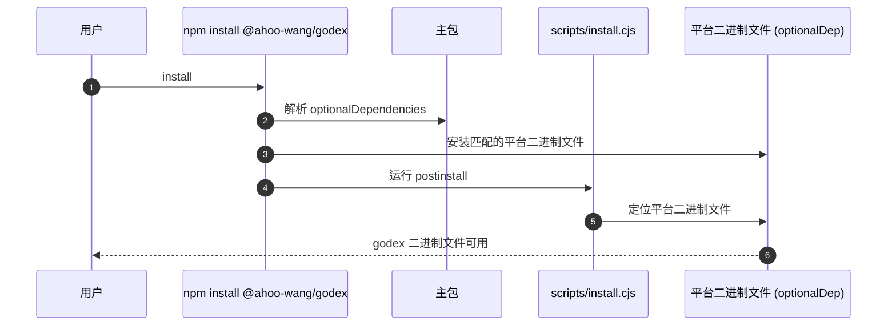

# 部署

GodeX 设计为零依赖部署：一个独立的静态二进制文件，暴露兼容 OpenAI 的 Responses API 网关。支持三种分发渠道——多阶段 Docker 镜像、六个平台目标的原生编译二进制文件，以及安装时自动选择正确平台二进制文件的 npm 包。构建系统使用 Bun 的 `--compile` 标志生成自包含的可执行文件，Docker 镜像使用两阶段构建以保持运行时层最小化。

## 概览

| 方面 | 详情 |
|---|---|
| 运行时 | 独立二进制文件（Bun compile） |
| Docker | 多阶段：`oven/bun` 构建 + `debian:bookworm-slim` 运行时 |
| 平台 | darwin-arm64、darwin-x64、linux-x64、linux-arm64、win32-x64、win32-arm64 |
| 默认端口 | `GODEX_PORT=5678` |
| 配置路径 | `/etc/godex/godex.yaml`（Docker） |
| 数据卷 | `/data` 用于会话和追踪 |

## Docker 部署

```mermaid
graph TB
    subgraph "Build Stage (oven/bun:1.3.14)"
        style "Build Stage (oven/bun:1.3.14)" fill:#161b22,stroke:#30363d,color:#e6edf3
        B1["bun install --frozen-lockfile"]
        B2["将 VERSION 注入 package.json"]
        B3["bun build --compile<br>--define GODEX_BUILD_ENV=prod"]
        B4["输出：/app/godex 二进制文件"]
        B1 --> B2 --> B3 --> B4
    end
    subgraph "Runtime Stage (debian:bookworm-slim)"
        style "Runtime Stage (debian:bookworm-slim)" fill:#161b22,stroke:#30363d,color:#e6edf3
        R1["COPY /app/godex -> /usr/local/bin/godex"]
        R2["mkdir /data (VOLUME)"]
        R3["mkdir /etc/godex (VOLUME)"]
        R4["EXPOSE 5678"]
        R5["ENTRYPOINT godex serve<br>--config /etc/godex/godex.yaml"]
        R1 --> R2 --> R3 --> R4 --> R5
    end
    B4 --> R1
```

Dockerfile 位于
[Dockerfile:1-53](https://github.com/Ahoo-Wang/GodeX/blob/main/Dockerfile#L1)，使用两阶段构建：

### 构建阶段

| 步骤 | 描述 |
|---|---|
| 基础镜像 | `oven/bun:1.3.14` |
| 依赖安装 | `bun install --frozen-lockfile --ignore-scripts` |
| 版本注入 | `sed` 通过 `ARG VERSION` 替换 `package.json` 中的版本 |
| 编译 | `bun build --compile`，目标从 `TARGETARCH` 派生 |
| 定义 | `GODEX_BUILD_ENV="prod"` 编入二进制文件 |

`TARGETARCH` 构建参数在
[Dockerfile:22-28](https://github.com/Ahoo-Wang/GodeX/blob/main/Dockerfile#L22) 映射为 Bun 编译目标：`amd64` -> `x64`、`arm64` -> `arm64`。

### 运行时阶段

| 方面 | 值 |
|---|---|
| 基础镜像 | `debian:bookworm-slim` |
| 二进制文件位置 | `/usr/local/bin/godex` |
| 数据卷 | `/data`（会话、追踪） |
| 配置卷 | `/etc/godex` |
| 默认端口 | `5678`（环境变量 `GODEX_PORT`） |
| 入口点 | `godex serve --config /etc/godex/godex.yaml` |

### Docker 使用方法

```bash
# 构建
docker build --build-arg VERSION=1.0.0 -t godex .

# 运行
docker run -d \
  -p 5678:5678 \
  -v /path/to/godex.yaml:/etc/godex/godex.yaml \
  -v godex-data:/data \
  godex
```

## 原生二进制编译

```mermaid
flowchart LR
    subgraph "scripts/compile.ts"
        style "scripts/compile.ts" fill:#161b22,stroke:#30363d,color:#e6edf3
        A["bun run compile<br>（当前平台）"]
        B["bun run compile --all<br>（全部 6 个平台）"]
        C["bun run compile<br>--target=darwin-arm64"]
    end
    subgraph "输出"
        style "输出" fill:#161b22,stroke:#30363d,color:#e6edf3
        D["platforms/darwin-arm64/bin/godex"]
        E["platforms/linux-x64/bin/godex"]
        F["platforms/win32-x64/bin/godex.exe"]
    end
    A --> D
    B --> D
    B --> E
    B --> F
```

编译脚本位于
[scripts/compile.ts:1-107](https://github.com/Ahoo-Wang/GodeX/blob/main/scripts/compile.ts#L1)，支持三种模式：

| 模式 | 命令 | 目标 |
|---|---|---|
| 当前平台 | `bun run compile` | 匹配 `process.platform` + `process.arch` |
| 所有平台 | `bun run compile --all` | 全部六个平台 |
| 指定目标 | `bun run compile --target=darwin-arm64` | 单个平台 |

### 平台矩阵

定义于
[scripts/compile.ts:11-42](https://github.com/Ahoo-Wang/GodeX/blob/main/scripts/compile.ts#L11)：

| 平台 | npm 包 | Bun 目标 |
|---|---|---|
| macOS ARM64 | `@ahoo-wang/godex-darwin-arm64` | `bun-darwin-arm64` |
| macOS x64 | `@ahoo-wang/godex-darwin-x64` | `bun-darwin-x64` |
| Linux x64 | `@ahoo-wang/godex-linux-x64` | `bun-linux-x64` |
| Linux ARM64 | `@ahoo-wang/godex-linux-arm64` | `bun-linux-arm64` |
| Windows x64 | `@ahoo-wang/godex-win32-x64` | `bun-windows-x64` |
| Windows ARM64 | `@ahoo-wang/godex-win32-arm64` | `bun-windows-arm64` |

所有构建通过 [第 83 行](https://github.com/Ahoo-Wang/GodeX/blob/main/scripts/compile.ts#L83) 的 `--define` 注入 `GODEX_BUILD_ENV="prod"`。

## npm 包分发



`package.json` 位于
[package.json:1-75](https://github.com/Ahoo-Wang/GodeX/blob/main/package.json#L1)，在
[第 49-55 行](https://github.com/Ahoo-Wang/GodeX/blob/main/package.json#L49) 声明平台特定二进制文件为 `optionalDependencies`：

```json
"optionalDependencies": {
  "@ahoo-wang/godex-darwin-arm64": "0.0.2",
  "@ahoo-wang/godex-darwin-x64": "0.0.2",
  "@ahoo-wang/godex-linux-x64": "0.0.2",
  "@ahoo-wang/godex-linux-arm64": "0.0.2",
  "@ahoo-wang/godex-win32-x64": "0.0.2",
  "@ahoo-wang/godex-win32-arm64": "0.0.2"
}
```

`postinstall` 脚本位于
[第 45 行](https://github.com/Ahoo-Wang/GodeX/blob/main/package.json#L45)，运行 `scripts/install.cjs` 来定位并链接正确的二进制文件。

## 环境变量

`EnvVars` 位于
[src/config/env.ts:15-30](https://github.com/Ahoo-Wang/GodeX/blob/main/src/config/env.ts#L15)，从编译时 `GODEX_BUILD_ENV` 定义解析运行时环境：

| 变量 | 用途 | 值 |
|---|---|---|
| `GODEX_BUILD_ENV` | 编译时环境（编入二进制文件） | `prod`、`dev`（默认） |
| `GODEX_PORT` | 默认服务器端口（Docker） | 默认：`5678` |

`Env` 枚举位于
[src/config/env.ts:2-5](https://github.com/Ahoo-Wang/GodeX/blob/main/src/config/env.ts#L2)，暴露 `EnvVars.isDev` 和 `EnvVars.isProd` 用于整个代码库中的条件行为。

## CI 流水线

`ci` 脚本位于
[package.json:42](https://github.com/Ahoo-Wang/GodeX/blob/main/package.json#L42)，运行完整的验证链：

```bash
bun run typecheck && biome ci src && bun run test && bun run test:e2e
```

| 步骤 | 命令 | 用途 |
|---|---|---|
| 类型检查 | `tsc --noEmit` | TypeScript 正确性 |
| Lint | `biome ci src` | 代码风格强制执行 |
| 单元测试 | `bun test` | 所有测试（排除 E2E） |
| E2E 测试 | `bun test src/e2e` | 端到端集成 |

`check` 脚本位于
[第 41 行](https://github.com/Ahoo-Wang/GodeX/blob/main/package.json#L41) 是 pre-push 门控：`typecheck + lint + test`。

### E2E 测试目标

| 命令 | 提供商 | 实时标志 |
|---|---|---|
| `test:zhipu` | 智谱 | `ZHIPU_LIVE_TESTS=1` |
| `test:deepseek` | DeepSeek | `DEEPSEEK_LIVE_TESTS=1` |
| `test:minimax` | MiniMax | `MINIMAX_LIVE_TESTS=1` |

## 交叉引用

- [CLI](../01-getting-started/cli.md) -- `godex serve` 和 `godex init` 命令
- [配置模式](../07-configuration/config-schema.md) -- godex.yaml 结构
- [服务器路由](../02-architecture/server-routes.md) -- 部署的服务器暴露的内容
- [CI/CD](./ci-cd.md) -- CI 流水线详情

## 参考文献

- [Dockerfile](https://github.com/Ahoo-Wang/GodeX/blob/main/Dockerfile) -- 多阶段 Docker 构建
- [package.json](https://github.com/Ahoo-Wang/GodeX/blob/main/package.json) -- npm 包和脚本
- [scripts/compile.ts](https://github.com/Ahoo-Wang/GodeX/blob/main/scripts/compile.ts) -- 原生二进制编译
- [src/config/env.ts](https://github.com/Ahoo-Wang/GodeX/blob/main/src/config/env.ts) -- 环境变量解析
- [src/cli/serve.ts](https://github.com/Ahoo-Wang/GodeX/blob/main/src/cli/serve.ts) -- serve 命令和关闭处理器
