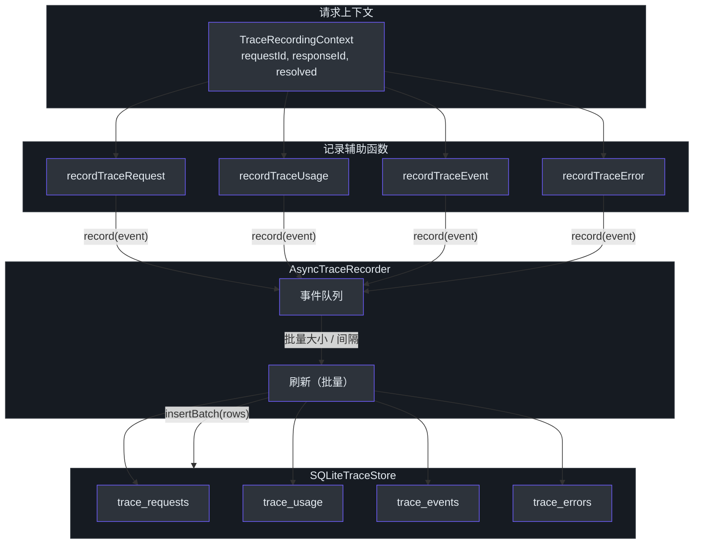
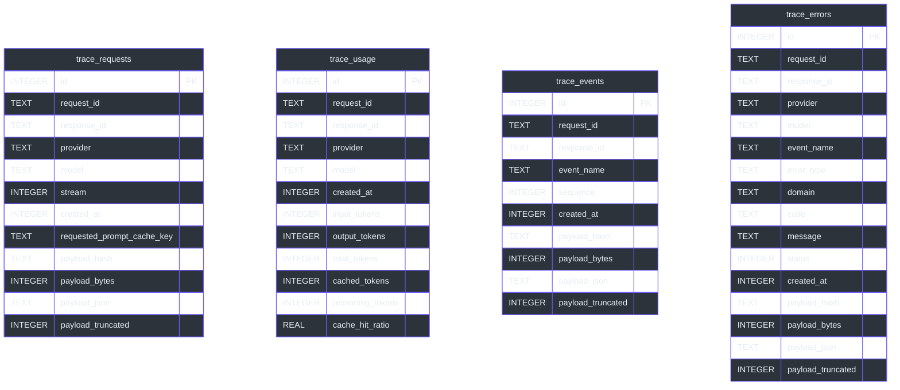
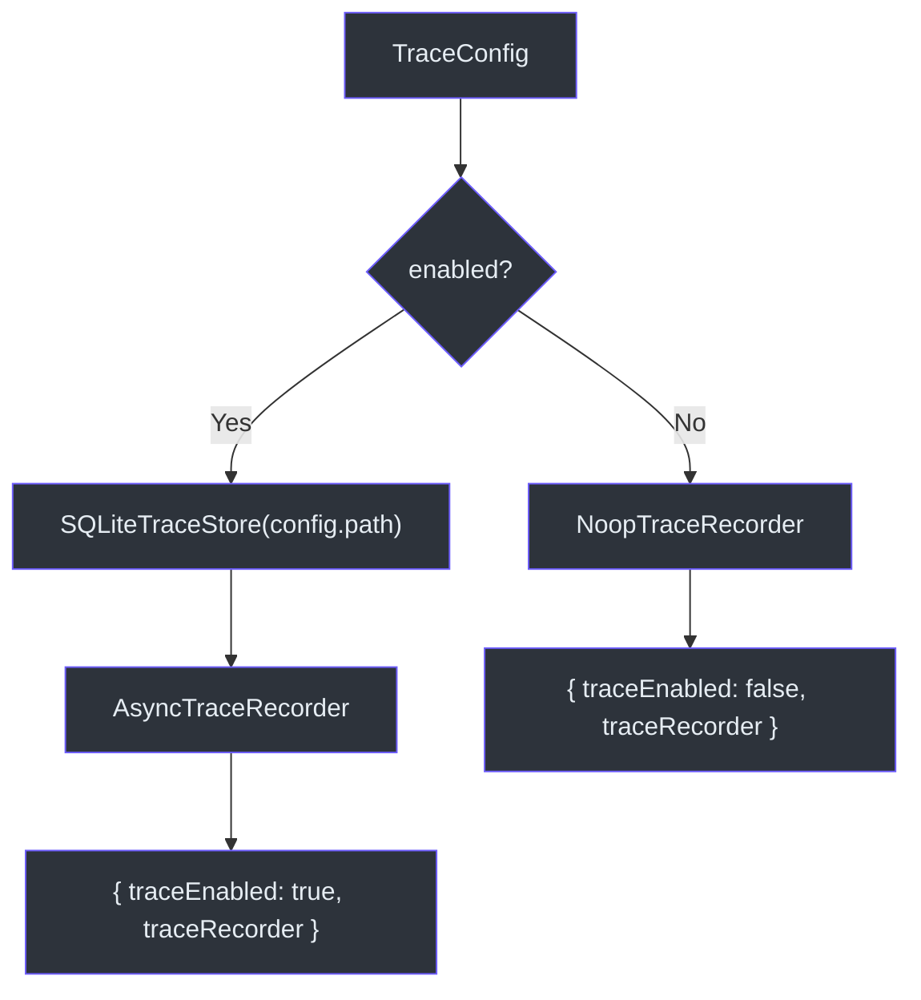

# 追踪系统

可观测性对于任何 LLM 网关都至关重要。GodeX 的追踪系统捕获整个请求生命周期中的每个请求、令牌使用事件、流式事件和错误，将它们持久化到 SQLite 以供离线分析。系统专为生产吞吐量设计：`AsyncTraceRecorder` 在队列中批量处理事件，定期或在批量大小阈值达到时刷新，使热路径免受磁盘 I/O 影响。当追踪禁用时，`NoopTraceRecorder` 以零成本替代真实的记录器。

追踪系统通过 `TraceRecordingContext` 附加到 `ResponsesContext`，因此任何能访问上下文的代码都可以发出追踪记录，而无需了解存储后端。

## 概览

| 组件 | 文件 | 用途 |
|---|---|---|
| `TraceRecorder` | [recorder.ts:5-8](https://github.com/Ahoo-Wang/GodeX/blob/main/src/trace/recorder.ts#L5) | 核心接口（`record`、`close`） |
| `AsyncTraceRecorder` | [recorder.ts:30-110](https://github.com/Ahoo-Wang/GodeX/blob/main/src/trace/recorder.ts#L30) | 基于队列的批量记录器 |
| `NoopTraceRecorder` | [recorder.ts:25-28](https://github.com/Ahoo-Wang/GodeX/blob/main/src/trace/recorder.ts#L25) | 追踪禁用时的零操作记录器 |
| `SQLiteTraceStore` | [sqlite.ts:69-297](https://github.com/Ahoo-Wang/GodeX/blob/main/src/trace/sqlite.ts#L69) | 包含四张表的 SQLite 存储 |
| `TraceRecordEvent` | [types.ts:70-74](https://github.com/Ahoo-Wang/GodeX/blob/main/src/trace/types.ts#L70) | 所有记录类型的联合类型 |
| `mapTraceRecordToRow` | [row-mapper.ts:16-98](https://github.com/Ahoo-Wang/GodeX/blob/main/src/trace/row-mapper.ts#L16) | 将事件转换为存储行 |
| `summarizePayload` | [payload.ts:10-35](https://github.com/Ahoo-Wang/GodeX/blob/main/src/trace/payload.ts#L10) | SHA-256 哈希、字节数、可选 JSON 捕获 |
| `TraceRecordingContext` | [context.ts:4-12](https://github.com/Ahoo-Wang/GodeX/blob/main/src/trace/context.ts#L4) | 附加到每个请求的上下文 |
| `createTraceServices` | [trace-services.ts:15-34](https://github.com/Ahoo-Wang/GodeX/blob/main/src/context/trace-services.ts#L15) | 从配置创建服务的工厂函数 |

## 架构概览



## TraceRecorder 接口

`TraceRecorder` 接口（[recorder.ts:5-8](https://github.com/Ahoo-Wang/GodeX/blob/main/src/trace/recorder.ts#L5)）被刻意设计得很简洁：

| 方法 | 描述 |
|---|---|
| `record(event)` | 将追踪事件加入队列以供持久化 |
| `close()` | 刷新剩余事件并释放资源 |

## AsyncTraceRecorder

生产记录器（[recorder.ts:30-110](https://github.com/Ahoo-Wang/GodeX/blob/main/src/trace/recorder.ts#L30)）使用内存队列和两个刷新触发器：

```mermaid
sequenceDiagram
    autonumber
    participant Helper as 记录辅助函数
    participant Recorder as AsyncTraceRecorder
    participant Queue as 事件队列
    participant Store as SQLiteTraceStore

    Helper->>Recorder: record(event)
    Recorder->>Queue: push(event)
    alt 队列已满 (>= maxQueueSize)
        Recorder-->>Recorder: warn("trace.queue.full")，丢弃事件
    else 队列大小 >= batchSize
        Recorder->>Recorder: scheduleFlush()
    end

    Note over Recorder: 定时器每隔 flushIntervalMs 触发
    Recorder->>Recorder: flush()
    Recorder->>Queue: splice(0, batchSize)
    Queue-->>Recorder: batch[]
    Recorder->>Recorder: mapTraceRecordToRow(batch)
    Recorder->>Store: insertBatch(rows)
    Store-->>Recorder: 完成
    alt 队列中还有更多事件
        Recorder->>Recorder: flush() 再次执行
    end

    style Helper fill:#2d333b,stroke:#6d5dfc,color:#e6edf3
    style Recorder fill:#2d333b,stroke:#6d5dfc,color:#e6edf3
    style Queue fill:#2d333b,stroke:#6d5dfc,color:#e6edf3
    style Store fill:#2d333b,stroke:#6d5dfc,color:#e6edf3
```

### 配置选项

| 选项 | 类型 | 描述 |
|---|---|---|
| `maxQueueSize` | `number` | 队列中最大事件数；溢出时丢弃 |
| `batchSize` | `number` | 每次刷新的事件数量 |
| `flushIntervalMs` | `number` | 自动刷新的定时器间隔 |
| `store` | `TraceStoreWriter` | 存储后端（通常是 `SQLiteTraceStore`） |
| `logger` | `TraceRecorderLogger` | 用于警告丢弃和错误 |
| `capturePayload` | `boolean` | 是否存储完整 JSON 有效载荷 |
| `payloadMaxBytes` | `number` | 存储的有效载荷字节限制 |

## SQLiteTraceStore

SQLite 存储（[sqlite.ts:69-297](https://github.com/Ahoo-Wang/GodeX/blob/main/src/trace/sqlite.ts#L69)）在构造时自动迁移四张表：

### 数据库模式



批量插入包装在事务中（[sqlite.ts:90-95](https://github.com/Ahoo-Wang/GodeX/blob/main/src/trace/sqlite.ts#L90)）以保证原子性。在 `request_id`、`response_id`、`event_name` 和 `code` 上创建索引以优化常见查询模式。

## 追踪记录类型

`TraceRecordEvent` 联合类型（[types.ts:70-74](https://github.com/Ahoo-Wang/GodeX/blob/main/src/trace/types.ts#L70)）有四种变体：

| 类型 | 接口 | 关键字段 |
|---|---|---|
| `request` | `TraceRequestRecordEvent` | `stream`、`requested_prompt_cache_key`、`payload` |
| `usage` | `TraceUsageRecordEvent` | `usage`（input_tokens、output_tokens、total_tokens、cached_tokens、reasoning_tokens、cache_hit_ratio） |
| `event` | `TraceEventRecordEvent` | `event_name`、`sequence`、`payload` |
| `error` | `TraceErrorRecordEvent` | `event_name`、`error_type`、`domain`、`code`、`message`、`status`、`payload` |

所有变体共享 `TraceRecordBase`（[types.ts:19-25](https://github.com/Ahoo-Wang/GodeX/blob/main/src/trace/types.ts#L19)），包含 `request_id`、`response_id`、`provider`、`model` 和 `created_at`。

### 事件名称

`TraceEventRecordEvent` 将 `event_name`（[types.ts:50-54](https://github.com/Ahoo-Wang/GodeX/blob/main/src/trace/types.ts#L50)）限制为：

| 事件名称 | 记录时机 |
|---|---|
| `provider.request.body` | 发送到上游的原始请求体 |
| `provider.response.body` | 从上游接收的原始响应体 |
| `upstream.stream.event.raw` | 来自上游的原始 SSE 数据块 |
| `upstream.stream.event.transformed` | 桥接转换后的事件 |

## 有效载荷捕获

`summarizePayload`（[payload.ts:10-35](https://github.com/Ahoo-Wang/GodeX/blob/main/src/trace/payload.ts#L10)）控制存储多少数据：

| 模式 | `capturePayload` | `payload_json` | `payload_hash` |
|---|---|---|---|
| 仅摘要 | `false` | `null` | 完整 JSON 的 SHA-256 十六进制值 |
| 完整捕获 | `true` | 完整 JSON 字符串（不超过 `payloadMaxBytes`） | SHA-256 十六进制值 |
| 截断捕获 | `true` | 截断的 JSON 字符串 | SHA-256 十六进制值 |

`payload_bytes` 字段始终记录原始字节长度，无论是否截断（[payload.ts:23-24](https://github.com/Ahoo-Wang/GodeX/blob/main/src/trace/payload.ts#L23)）。哈希使用 `Bun.CryptoHasher("sha256")` 计算（[payload.ts:6-8](https://github.com/Ahoo-Wang/GodeX/blob/main/src/trace/payload.ts#L6)）。

## 行映射

`mapTraceRecordToRow`（[row-mapper.ts:16-98](https://github.com/Ahoo-Wang/GodeX/blob/main/src/trace/row-mapper.ts#L16)）根据 `event.kind` 进行分发：

| 类型 | 目标表 | 有效载荷处理 |
|---|---|---|
| `request` | `trace_requests` | 使用 `summarizePayload` 摘要化 |
| `usage` | `trace_usage` | 从 `TraceUsageSnapshot` 直接提取字段 |
| `event` | `trace_events` | 使用 `summarizePayload` 摘要化 |
| `error` | `trace_errors` | 使用 `summarizePayload` 摘要化 |

如果任何事件的序列化失败，映射器返回 `null` 并记录警告，而不是导致刷新崩溃（[row-mapper.ts:91-97](https://github.com/Ahoo-Wang/GodeX/blob/main/src/trace/row-mapper.ts#L91)）。

## 记录辅助函数

四个辅助函数附加到 `TraceRecordingContext`，提供便捷的记录方式：

### recordTraceRequest

[request-recorder.ts:4-22](https://github.com/Ahoo-Wang/GodeX/blob/main/src/trace/request-recorder.ts#L4) 记录提供商请求的开始，包括是否为流式请求、可选的 `prompt_cache_key`，以及可选的完整提供商请求体。

### recordTraceUsage

[usage-recorder.ts:6-22](https://github.com/Ahoo-Wang/GodeX/blob/main/src/trace/usage-recorder.ts#L6) 通过 `traceUsageFromResponseUsage`（[usage.ts:4-23](https://github.com/Ahoo-Wang/GodeX/blob/main/src/trace/usage.ts#L4)）将 `ResponseUsage` 转换为 `TraceUsageSnapshot`，该函数还在 `cached_tokens` 和 `input_tokens` 都可用时计算 `cache_hit_ratio` 为 `cached_tokens / input_tokens`。

### recordTraceEvent

[event-recorder.ts:5-25](https://github.com/Ahoo-Wang/GodeX/blob/main/src/trace/event-recorder.ts#L5) 记录一个命名事件，带有可选的有效载荷和用于流内排序的序列号。

### recordTraceError

[error-recorder.ts:5-27](https://github.com/Ahoo-Wang/GodeX/blob/main/src/trace/error-recorder.ts#L5) 从 `GodeXError` 或通用错误中提取错误元数据（类型、领域、错误码、消息、状态码），并以完整的错误上下文作为有效载荷进行记录。

## 服务装配

`createTraceServices`（[trace-services.ts:15-34](https://github.com/Ahoo-Wang/GodeX/blob/main/src/context/trace-services.ts#L15)）读取 `TraceConfig` 并创建由 `SQLiteTraceStore` 支持的 `AsyncTraceRecorder`（当 `config.enabled` 为 true 时）或 `NoopTraceRecorder`（当为 false 时）：



## 交叉引用

- [会话存储](../04-session-management/session-stores.md) -- 会话存储系统使用类似的 SQLite 持久化模式
- [ProviderSpec 契约](../03-provider-development/provider-spec.md) -- 追踪记录中的 provider 和 model 字段来自已解析的规格

## 参考文献

- [src/trace/recorder.ts](https://github.com/Ahoo-Wang/GodeX/blob/main/src/trace/recorder.ts) -- `TraceRecorder`、`AsyncTraceRecorder`、`NoopTraceRecorder`
- [src/trace/sqlite.ts](https://github.com/Ahoo-Wang/GodeX/blob/main/src/trace/sqlite.ts) -- `SQLiteTraceStore`、模式迁移
- [src/trace/types.ts](https://github.com/Ahoo-Wang/GodeX/blob/main/src/trace/types.ts) -- 所有追踪记录事件类型
- [src/trace/context.ts](https://github.com/Ahoo-Wang/GodeX/blob/main/src/trace/context.ts) -- `TraceRecordingContext`
- [src/trace/request-recorder.ts](https://github.com/Ahoo-Wang/GodeX/blob/main/src/trace/request-recorder.ts) -- `recordTraceRequest`
- [src/trace/usage-recorder.ts](https://github.com/Ahoo-Wang/GodeX/blob/main/src/trace/usage-recorder.ts) -- `recordTraceUsage`
- [src/trace/event-recorder.ts](https://github.com/Ahoo-Wang/GodeX/blob/main/src/trace/event-recorder.ts) -- `recordTraceEvent`
- [src/trace/error-recorder.ts](https://github.com/Ahoo-Wang/GodeX/blob/main/src/trace/error-recorder.ts) -- `recordTraceError`
- [src/trace/row-mapper.ts](https://github.com/Ahoo-Wang/GodeX/blob/main/src/trace/row-mapper.ts) -- `mapTraceRecordToRow`
- [src/trace/payload.ts](https://github.com/Ahoo-Wang/GodeX/blob/main/src/trace/payload.ts) -- `summarizePayload`、`sha256Hex`
- [src/trace/usage.ts](https://github.com/Ahoo-Wang/GodeX/blob/main/src/trace/usage.ts) -- `traceUsageFromResponseUsage`
- [src/trace/time.ts](https://github.com/Ahoo-Wang/GodeX/blob/main/src/trace/time.ts) -- `nowTraceMillis`
- [src/context/trace-services.ts](https://github.com/Ahoo-Wang/GodeX/blob/main/src/context/trace-services.ts) -- `createTraceServices`
